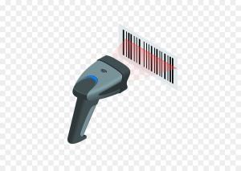

## Идея
 
 Игрок управляет персонажем, который должен пройти через различные уровни, стреляя во врагов при помощи сканера QR/штрих кодов

## Задачи

- [ ] Анимированные спрайты (1 текстура, отражение спрайта)
- [ ] Графика (draw/fill методы, отрисовка спрайтов, viewport и работа с GraphicsDevice, camera)
- [ ] Сделать обработку клавиш (Pressed, Down, Released)
- [x] Физика, колизия, оптимизация
- [ ] Улучшение графики (scale, rotation)